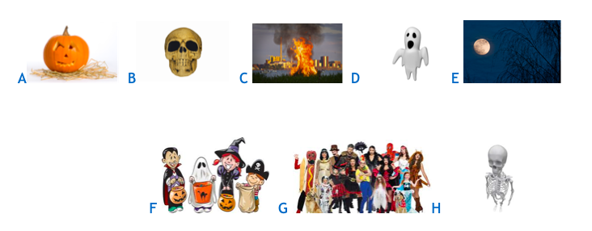
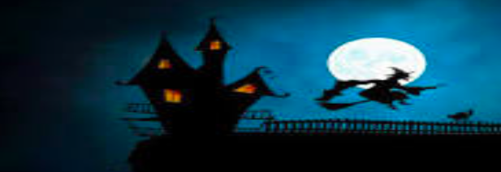
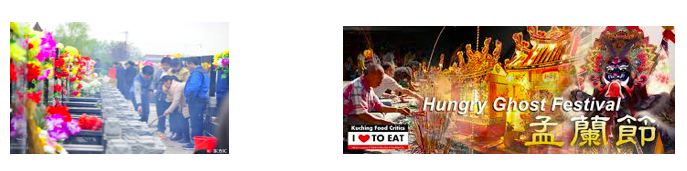

# 万圣节（Halloween）

## 课程目标

- 学习与万圣节有关的词汇

- 讨论西方世界的万圣节习俗

- 谈谈中国文化中与万圣节类似的习俗

## 词汇

连接词汇与图片

**a bonfire, costumes, a full moon, a ghost, a Jack O’Lantern, a skeleton, a skull, trick-or-treating**

## 万圣节历史及中国类似习俗

Halloween **originated** from the traditional holiday of **Celts** in Great Britain who believed that the last day of October was “the day of the dead” or “the ghost day” when ghosts crossed over the **boundary** between the living and the dead. It evolved into a day of fun and parties for most people. However, in English speaking countries such as America and Britain, many take the day seriously as a special day for religious prayers or **witchcraft**.

The Chinese days of the dead are a part of the religion of the common people. A greater percentage of Chinese than Westerners really believe that on these days there is more of a bridge between the dead and the living, and so they must take **precautions** or honour the dead.

阅读上面的材料之后，请匹配下面的单词及意思：

**Celts (kelt), Boundary, originated, Witchcraft, Precautions**

A. a line which marks the limits of an area; a dividing line.

B. a person belonging to a people from western Europe who came to live in ancient Britain before the Romans

C. to prevent something dangerous, unpleasant, or inconvenient from happening.

D. the practice of magic, the use of spells.

E. to come from a particular place, time, situation

## 回答问题

1. Which object from the pictures is used to keep away evil spirits?

2. Do you have any full moon traditions in your country?

3. Which Halloween traditions do you take part in?

4. Is Halloween getting more or less popular in your country?

## 你能说一说下面这些中国的节日吗？

1. The Hungry Ghost Festival

2. The seventh month of the Chinese lunar calendar

3. The Qing Ming Festival

4. The Chinese Spring Festival

