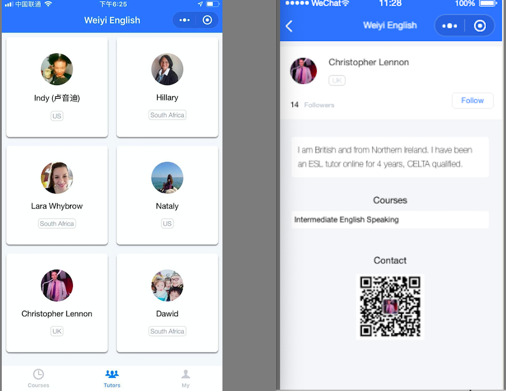
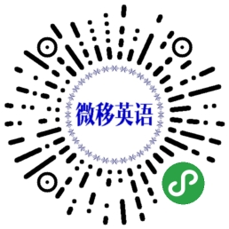
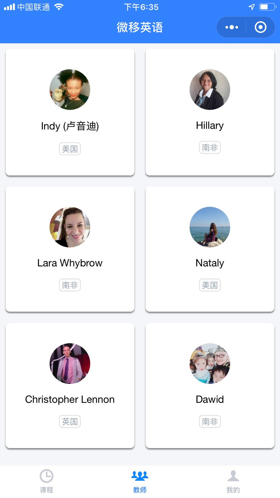
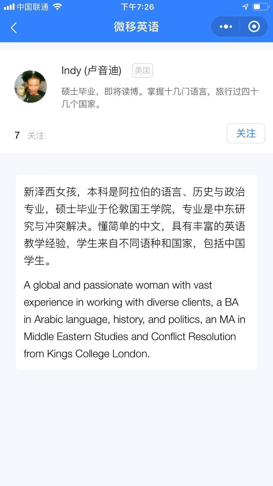
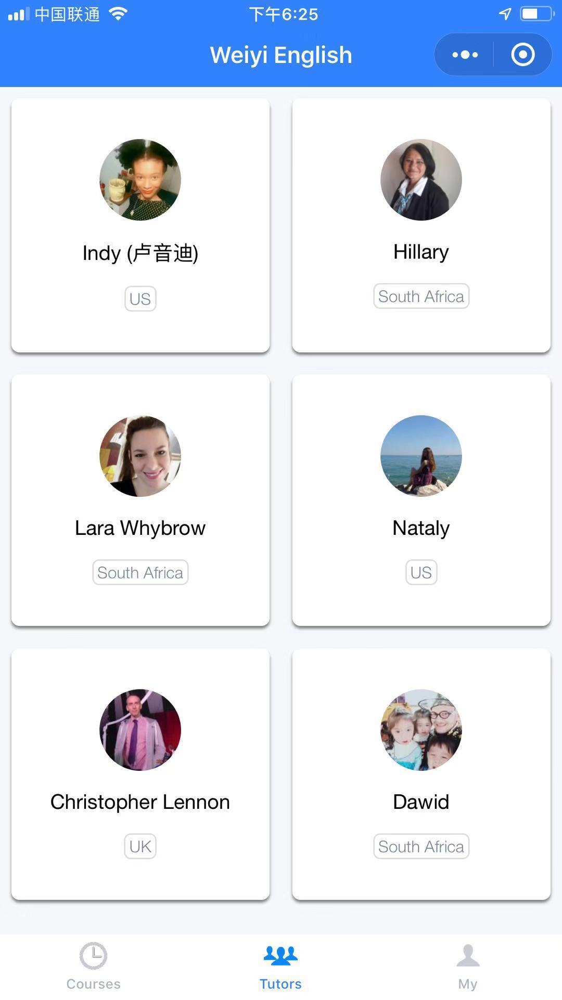
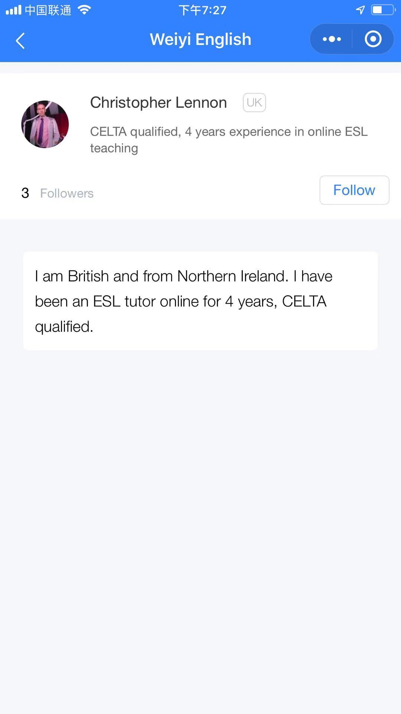

# Weiyi English Mini Program (WEMP)

We are creating a mini platform for English teachers and students, especially for Chinese students. Its essential function is to present English teachers and their courses on the mini program, and offer activities and classes in Wechat groups.

The goal of the project is to create an English community on Wechat. It allows students to get to know the teachers and courses well. After that, students will be confident in choosing appropriate courses for themselves.

Basic 2 steps in the beginning:

1. Present teachers' profiles.

It displays your nationality, introdiction, an qr code. For example:

  

2. Offer English activities(classes) in groups. (optional)

Activities are varied. You can introduce your courses, talk about travel or food, play English games, do quizzes, read books, tell stories, etc. Point is to make students practise their English skills during the activities.

Most teachers and students are familiar with video or live classes, which would happen on a specific software. We do not provide such classes currently in the mini program. You can introduce your one on one courses in the community though. Now we focus on **combining the mini program and Wechat groups to create an active English community**.

Scanning the QR code below to open WEMP:

  

## Teachers and profiles

### (Chinese)

  
  

Todo:

- Filters: Nationality, gender, favorites, stars

- Search

- Favorite and stars

### (English)

  
  

