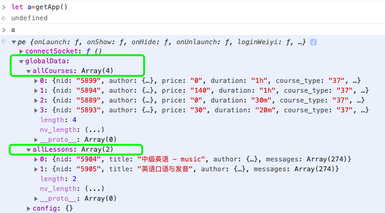

### 1. Login log

用户访问、登录信息

### 2. New user accesses

- Create a user in wechat_users.
    open_id
    session_key
    session3rd

- Create a Drupal user

### 3. User login

[todo]

Update user profile

- nickname, sex, avatar_url in wechat_users
- nickname, sex, avatar url in Drupal

### 4. Page: Teacher detail

### 5. 访问小程序时的初始信息 - courses & lessons

  

